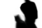

# Bad Apple Project



Encode a video using a tiny neural network in GLSL.

Run the flow:

```shell
make
```

This will download the video, extract frames, train the neural network, and generate the shader code.